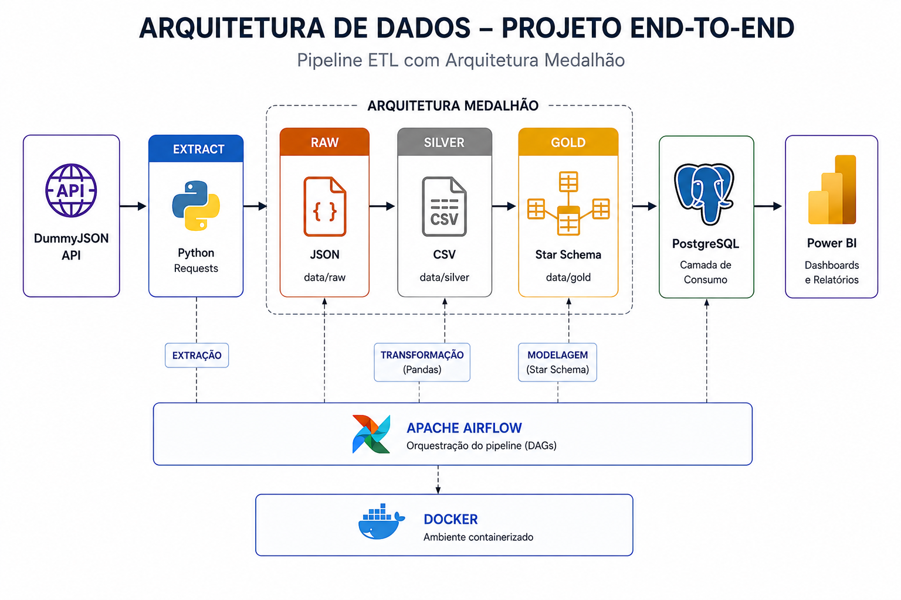
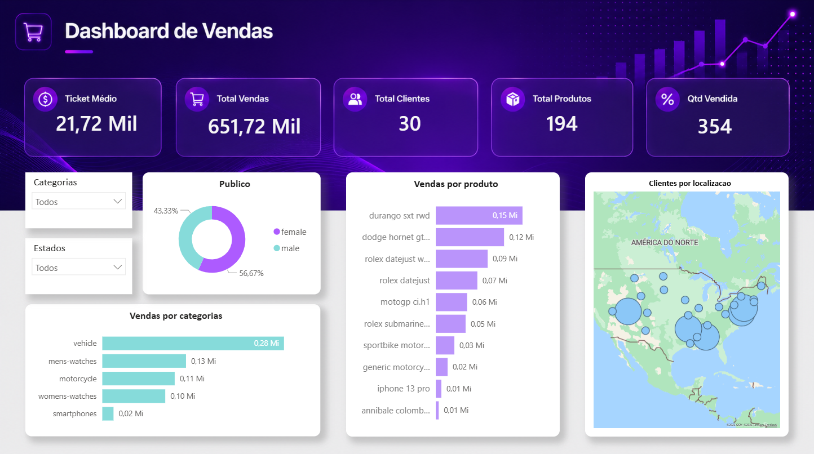

# Pipeline ETL End-to-End com Apache Airflow

## Sobre o Projeto

Este projeto tem como objetivo demonstrar a construção de um pipeline de dados completo utilizando a API DummyJSON como fonte de dados.

Os dados são extraídos da API, armazenados em uma arquitetura medalhão (Raw, Silver e Gold), modelados em esquema estrela, carregados em PostgreSQL e consumidos por um dashboard desenvolvido no Power BI.

Todo o processo é orquestrado pelo Apache Airflow executando em containers Docker.

---

## Arquitetura



---

## Fluxo do Pipeline

```text
DummyJSON API
    ↓
Raw (JSON)
    ↓
Silver (CSV)
    ↓
Gold (Star Schema)
    ↓
PostgreSQL
    ↓
Power BI
```

---

## Arquitetura Medalhão

### Raw

Armazena os dados brutos extraídos da API DummyJSON no formato JSON.

### Silver

Camada responsável pela limpeza, tratamento e padronização dos dados utilizando Pandas.

### Gold

Camada analítica contendo as tabelas modeladas em esquema estrela para consumo pelo PostgreSQL e Power BI.

---

## Modelo Estrela

### Tabela Fato

* fact_cart_items

### Dimensões

* dim_products
* dim_users
* dim_address

---

## Estrutura do Projeto

```text
projeto_pipeline_vendas/
│
├── airflow/
│   ├── dags/
│   ├── logs/
│   └── plugins/
│
├── config/
│
├── data/
│   ├── raw/
│   ├── silver/
│   └── gold/
│
├── scripts/
│   ├── extract/
│   ├── transform/
│   ├── gold/
│   └── load/
│
├── dashboard/
│
└── README.md
```

---

## Orquestração com Airflow

A execução do pipeline é realizada através do Apache Airflow.


---

## Dashboard

Os dados carregados no PostgreSQL são consumidos pelo Power BI para criação de indicadores e análises de vendas.



---

## Tecnologias Utilizadas

* Python
* Pandas
* PostgreSQL
* SQLAlchemy
* Apache Airflow
* Docker
* Power BI

---

## Como Executar

Subir os containers:

```bash
docker compose up -d
```

Acessar o Airflow:

```text
http://localhost:8080
```

Executar a DAG:

```text
dummyjson_etl_pipeline
```

---

## Possíveis Evoluções

* Utilização de arquivos Parquet nas camadas Silver e Gold
* Implementação de testes automatizados
* Deploy em ambiente cloud
* Integração com Data Lake

```
```
